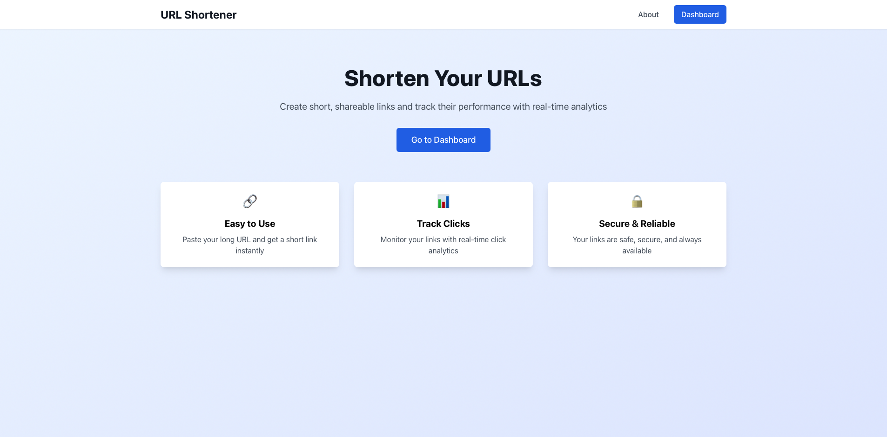
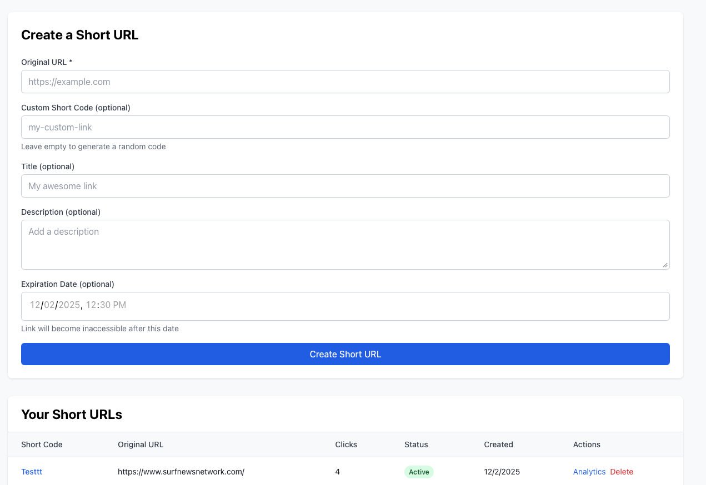
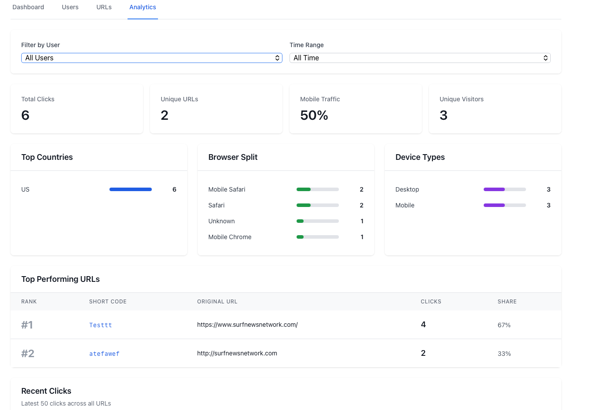
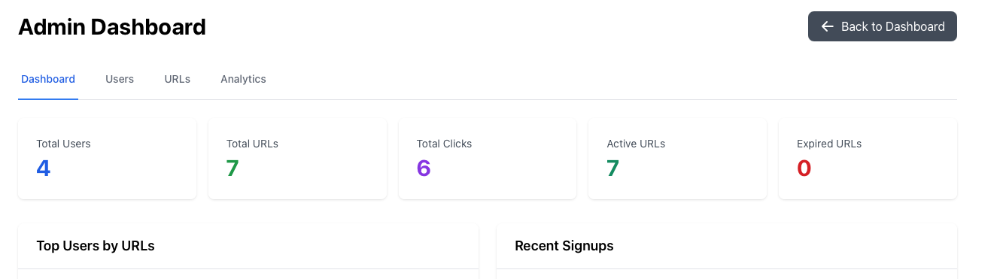

<div align="center">

# 🔗 URL Shortener

### Production-Ready Full-Stack Application

[](https://github.com/Travis-Code/url-shortener/actions)
[](https://www.typescriptlang.org/)
[](https://reactjs.org/)
[](https://nodejs.org/)
[](https://www.postgresql.org/)

**A modern, enterprise-grade URL shortening platform with comprehensive analytics, user authentication, and admin controls.**

[Features](#-features) • [Quick Start](#-quick-start) • [Tech Stack](#-tech-stack) • [API](#-api-endpoints) • [Architecture](#-project-architecture)

</div>

---

## 🎯 Overview

Transform long URLs into short, trackable links with powerful analytics. Built with production-ready patterns including JWT authentication, PostgreSQL with proper schema design, comprehensive security measures, and real-time click tracking.

**Perfect for:**
- 📊 Marketing campaigns with detailed attribution
- 🎓 Educational content distribution
- 💼 Professional link management
- 📱 Social media optimization

### ✨ What Makes This Special

- **Port Isolation System** - Custom guard scripts prevent development conflicts
- **Enterprise Security** - Helmet.js, rate limiting, XSS protection, strong JWT
- **Complete Analytics Suite** - Geographic tracking, device breakdown, browser analytics
- **Admin Dashboard** - Full system monitoring and user management
- **CI/CD Ready** - GitHub Actions, smoke tests, automated validation

## 📸 Screenshots

### Landing Page


### Dashboard - Create & Manage URLs


### Admin Analytics - Click Tracking & Insights


### Admin Panel - System Overview


## 🚀 Live Demo

The app is live and ready to share.

- Frontend (Vercel): https://client-2stkryi8y-boom-codes-projects.vercel.app
- Backend (Railway API): https://url-shortener-production-c83f.up.railway.app
- Example Short Link: https://url-shortener-production-c83f.up.railway.app/atefawef

Tip: If you see `localhost` in any link preview, refresh the page — the UI now uses the production BASE_URL.

---

## ⚡ Features

<table>
<tr>
<td width="50%">

### 🔐 Authentication & Security
- JWT-based authentication
- Bcrypt password hashing
- Rate limiting (5 attempts/15min)
- XSS input sanitization
- Helmet.js security headers
- CORS protection
- Admin role-based access

### 📊 Analytics Dashboard
- Real-time click tracking
- Geographic insights (country/city)
- Browser & OS breakdown
- Device type analytics (mobile/tablet/desktop)
- Referrer tracking
- Time-based filtering
- Visual charts & progress bars

</td>
<td width="50%">

### 🔗 URL Management
- Custom short codes
- Title & description metadata
- Optional expiration dates
- Bulk link management
- One-click deletion
- Auto-cleanup scripts

## 🎤 Hiring Manager Pitch

This project demonstrates end-to-end, production-grade engineering:
- Full-Stack: React + TypeScript + Node/Express + PostgreSQL
- Real Features: Auth, REST API, URL shortening, analytics, admin
- Ops Ready: CI, environment config, migrations, error handling
- Deployment: Frontend on Vercel; Backend + DB on Railway

Live Links:
- App: https://client-2stkryi8y-boom-codes-projects.vercel.app
- API/Short Links: https://url-shortener-production-c83f.up.railway.app

Talking points:
- Built with modern patterns and strong security defaults
- Clean UI with Tailwind + React Router
- Analytics include geolocation and user agent breakdown
- Ready to plug into custom domains when needed

If you’d like custom domains or a branded landing page, see the Deployment Notes and I can wire it up quickly.

### 👨‍💼 Admin Tools
- System-wide statistics
- User management (ban/unban)
- All URLs monitoring
- Top performers ranking
- Advanced filtering
- Full audit trail

</td>
</tr>
</table>

### 🛡️ Production-Grade Infrastructure

- **Port Isolation** - Automatic guards prevent dev conflicts
- **CI/CD Pipeline** - GitHub Actions with smoke tests
- **Database Migrations** - Version-controlled schema updates
- **Error Handling** - Comprehensive validation & logging
- **Scalable Architecture** - RESTful API design

---

## 🛠️ Tech Stack

<table>
<tr>
<td align="center" width="33%">

### Frontend


</td>
<td align="center" width="33%">

### Backend


</td>
<td align="center" width="33%">

### Database & Tools


</td>
</tr>
</table>

**Key Dependencies:**
- **Authentication:** `jsonwebtoken`, `bcryptjs`
- **Security:** `helmet`, `express-rate-limit`, `xss`, `cors`
- **Analytics:** `geoip-lite`, `ua-parser-js`
- **Database:** `pg` (PostgreSQL client)
- **Development:** `ts-node-dev`, `typescript`, `eslint`

---

## 📂 Project Architecture

```
FullStackProject/
├── 🖥️  server/                      # Backend API (Node.js + Express)
│   ├── src/
│   │   ├── db/                     # Database layer
│   │   │   ├── init.ts            # Schema initialization
│   │   │   ├── pool.ts            # PostgreSQL connection pool
│   │   │   └── migrations/        # Version-controlled migrations
│   │   ├── routes/                # RESTful API endpoints
│   │   │   ├── auth.ts           # Login, signup
│   │   │   ├── urls.ts           # URL CRUD, redirect, analytics
│   │   │   ├── admin.ts          # Admin dashboard APIs
│   │   │   └── diagnostics.ts   # Health checks
│   │   ├── middleware/           # Express middleware
│   │   │   ├── auth.ts          # JWT verification
│   │   │   └── admin.ts         # Role-based access control
│   │   ├── scripts/             # Utility scripts
│   │   │   ├── seed.ts         # Demo data seeder
│   │   │   └── cleanupExpired.ts
│   │   ├── test/               # Integration & smoke tests
│   │   │   ├── smoke.js        # Server smoke test
│   │   │   └── *.test.ts       # Jest integration tests
│   │   └── index.ts           # Express app entry point
│   └── .env.example
│
├── 🎨 client/                      # Frontend SPA (React + Vite)
│   ├── src/
│   │   ├── pages/               # Route components
│   │   │   ├── Home.tsx        # Landing page
│   │   │   ├── Login.tsx       # Authentication
│   │   │   ├── Dashboard.tsx   # User URL management
│   │   │   ├── Analytics.tsx   # Detailed click stats
│   │   │   └── Admin.tsx       # System administration
│   │   ├── components/         # Reusable UI components
│   │   ├── api/               # Axios API client
│   │   └── utils/            # Auth context, helpers
│   └── vite.config.ts
│
├── 🔧 scripts/                    # Development utilities
│   ├── check-port.sh            # Port isolation guard
│   └── smoke.sh                 # Automated smoke tests
│
└── 📚 Documentation
    ├── README.md               # This file
    ├── SECURITY.md            # Security best practices
    └── templates/            # README templates
```

---

## 🚀 Quick Start

### 📦 Deploy Options: Native vs Docker

- **Native (Recommended for production):**
  - Backend on Railway (Node builder), Frontend on Vercel.
  - Fast, minimal config, managed infra. Use this for your live app.
- **Docker (Optional):**
  - Great for local prod parity and self-hosting.
  - Use `docker compose` to run Postgres + API + Nginx.

### 🐳 Docker (Optional)

Get the entire stack running in one command:

```bash
# 1. Copy environment template
cp .env.docker.example .env

# 2. Generate JWT secret and update .env
node -e "console.log(require('crypto').randomBytes(32).toString('hex'))"

# 3. Start all services (Postgres + Backend + Frontend)
docker compose up

# 4. Access the app
# Frontend: http://localhost:3000
# Backend API: http://localhost:5001
# Postgres: localhost:5432
```

**Quick Commands:**
```bash
# Build and start in background
docker compose up -d

# View logs
docker compose logs -f

# Stop all services
docker compose down

# Reset database
docker compose down -v && docker compose up
```

---

### 💻 Manual Setup

### 📋 Prerequisites

| Requirement | Version | Installation |
|-------------|---------|-------------|
| **Node.js** | 16+ | [nodejs.org](https://nodejs.org/) |
| **PostgreSQL** | 12+ | [postgresql.org](https://www.postgresql.org/) or `brew install postgresql` |
| **npm** | Latest | Bundled with Node.js |

---

### 🗄️ Database Setup

```bash
# Create the PostgreSQL database
createdb url_shortener
```

> Tables are auto-created when the backend starts for the first time.

---

### ⚙️ Backend Setup

```bash
# 1. Navigate to server directory
cd server

# 2. Install dependencies
npm install

# 3. Configure environment
cp .env.example .env

# 4. Edit .env with your credentials:
#    PORT=5001
#    DATABASE_URL=postgresql://yourusername@localhost:5432/url_shortener
#    JWT_SECRET=your_super_secret_jwt_key_change_this_in_production
#    NODE_ENV=development
#    FRONTEND_URL=http://localhost:3000
#    BASE_URL=http://localhost:5001

# 5. Start development server (port guard enforced)
npm run dev
```

✅ **Backend running on:** `http://localhost:5001`

---

### 🎨 Frontend Setup

```bash
# 1. Navigate to client directory
cd client

# 2. Install dependencies
npm install

# 3. Start development server (port guard enforced)
npm run dev
```

✅ **Frontend running on:** `http://localhost:3000`

---

### 🔒 Port Isolation System

This project includes **automatic port guards** to prevent conflicts:

| Component | Port | Protection |
|-----------|------|-----------|
| **Frontend** | 3000 | `predev` hook checks availability |
| **Backend** | 5001 | `predev` hook checks availability |

**If a port is occupied:**
- ❌ `npm run dev` exits with an error
- 💡 Clear instructions guide you to free the port
- 🔍 Smoke tests validate isolation (`npm run smoke:all`)

**Freeing a port manually:**
```bash
lsof -ti:5001 | xargs kill -9  # Kill process on port 5001
```

---

## 🧪 Testing & Demo Data

### Seed Demo Content

Populate the database with demo users and sample URLs:

```bash
cd server
npm run seed
```

**Demo Accounts (local only):**
- Seed script creates demo users for local development.
- Passwords are not published in this repository or in production.

Note: Production deployments should not have default credentials. Use your own accounts.

**Includes:** 5 sample technology URLs with synthetic click analytics for testing.

## 🧭 Demo Walkthrough

Follow these steps to demo the app end-to-end:

1. Open the frontend: `https://client-2stkryi8y-boom-codes-projects.vercel.app`
2. Sign up or log in
  - Create a new account, or use your existing admin account
3. Create a short URL
  - Enter an original URL (e.g. `https://example.com`)
  - Optionally set a custom short code and expiration
4. Copy the generated short link
  - It will look like: `https://url-shortener-production-c83f.up.railway.app/<code>`
5. Open the short link in a new tab
  - Confirms redirect works
6. Check analytics
  - Go to `Analytics` from the URL row to see click metrics
7. Visit Admin Panel
  - `Admin` shows system stats, users, URLs, and clicks

If anything looks off, confirm environment variables are set in production (see Deployment Notes below).

## 📦 Deployment Notes (Production)

Environment variables to verify after deployment:

- Frontend (Vercel):
  - `VITE_API_URL` = `https://url-shortener-production-c83f.up.railway.app`
  - Optional: `VITE_BASE_URL` = `https://url-shortener-production-c83f.up.railway.app`

- Backend (Railway):
  - `DATABASE_URL` = provided by Railway Postgres
  - `JWT_SECRET` = strong 32+ byte secret
  - `NODE_ENV` = `production`
  - `FRONTEND_URL` = your Vercel domain (wildcard allowed for previews)
  - `BASE_URL` = `https://url-shortener-production-c83f.up.railway.app`

After updating env vars, re-deploy both apps. Old database entries with `localhost` won’t change; create new URLs to see the production domain.


```bash
cd server
npm test
```

**Test Coverage:**
- User signup & login (JWT authentication)
- URL creation, retrieval, and deletion
- URL redirection with click tracking
- Analytics data aggregation
- Admin-only endpoints

---

### Smoke Tests

Fast end-to-end sanity checks for both server and client:

```bash
npm run smoke:all
```

**Validates:**
- ✅ Backend health endpoint (`/api/health`)
- ✅ Frontend scaffolding (port 3000 reachable)
- ✅ Port isolation (only probes 3000/5001)

> **Note:** Fails fast if services cannot start or respond.

---

## 🔄 Continuous Integration

**GitHub Actions Workflow:** 

| Stage | Purpose |
|-------|---------|
| **Checkout** | Clone repository code |
| **Node Setup** | Install Node.js 16+ |
| **Install & Build** | Compile server and client TypeScript |
| **Smoke Tests** | Validate core functionality (`npm run smoke:all`) |

**Branch Protection:**
- Job name: `build`
- Status: Required check for `main` branch
- No automatic deployment (build validation only)

---

## 🛠️ Troubleshooting

### Backend Issues

| Problem | Solution |
|---------|----------|
| **Server not responding** | • Verify `.env` has `JWT_SECRET` and `DATABASE_URL`<br>• Check port: `lsof -nP -iTCP:5001 -sTCP:LISTEN`<br>• Kill process: `lsof -ti:5001 \| xargs kill -9`<br>• Test health: `curl http://localhost:5001/api/health` |
| **Database connection fails** | • Create DB: `createdb url_shortener`<br>• Verify URL: `psql "$DATABASE_URL" -c "\conninfo"`<br>• Confirm PostgreSQL is running: `pg_isready` |
| **TypeScript/Jest errors** | • Check `server/tsconfig.json` includes `types: ["node", "jest"]`<br>• Ensure `include: ["src", "test"]` is present |

### Frontend Issues

| Problem | Solution |
|---------|----------|
| **Port conflicts** | • Kill process: `lsof -ti:3000 \| xargs kill -9`<br>• Restart: `npm run dev` |
| **Build errors** | • Clear cache: `rm -rf node_modules && npm ci`<br>• Delete Vite cache: `rm -rf .vite` |

### Testing Issues

| Problem | Solution |
|---------|----------|
| **Smoke tests fail** | • Ensure services are running<br>• Check logs: `npm run smoke:all`<br>• Verify ports 3000 and 5001 are reachable |
| **CI failures** | • Check GitHub Actions logs<br>• Re-run locally: `npm run smoke:all`<br>• Validate TypeScript compilation: `npm run build` |

### Environment Configuration

Generate a strong JWT secret:
```bash
node -e "console.log(require('crypto').randomBytes(32).toString('hex'))"
```

Verify database URL format:
```bash
# Local example:
DATABASE_URL=postgresql://$USER@localhost:5432/url_shortener

# Test connection:
psql "$DATABASE_URL" -c "SELECT 1;"
```

---

## 📋 Common Commands

### Backend (Port 5001)

```bash
cd server

npm run dev          # Start API in development (port guard enforced)
npm run build        # Compile TypeScript to dist/
npm start            # Run compiled server
npm run seed         # Seed demo data (users + URLs)
npm run cleanup      # Purge expired URLs
npm test             # Run integration tests
```

**Health Check:**
```bash
curl http://localhost:5001/api/health
```

---

### Frontend (Port 3000)

```bash
cd client

npm run dev          # Start Vite dev server (port guard enforced)
npm run build        # Build for production
npm run preview      # Preview production build locally
```

---

### Testing & Isolation

```bash
# Run smoke tests (validates 3000/5001 isolation)
npm run smoke:all

# Manually check if port is free
./scripts/check-port.sh 5001 Backend

# Kill process on specific port (macOS)
lsof -ti:5001 | xargs kill -9 2>/dev/null || echo "Port 5001 free"
lsof -ti:3000 | xargs kill -9 2>/dev/null || echo "Port 3000 free"
```

---

---

## 🚀 Deployment Guide

### Current Status

| Component | Status | Details |
|-----------|--------|---------|
| **🟢 Local Development** | Fully functional | Backend: `localhost:5001`<br>Frontend: `localhost:3000`<br>Database: Local PostgreSQL |
| **⏳ Production** | Ready to deploy | Configuration complete, pending deployment |

---

### Backend Deployment (Railway) — Native (Recommended)

**Recommended Platform:** [Railway](https://railway.app)

```bash
# 1. Create new project on Railway
# 2. Add PostgreSQL plugin (auto-provisions database with SSL)
# 3. Connect GitHub repository
```

**Build Configuration:**
```json
{
  "buildCommand": "npm install && npm run build",
  "startCommand": "npm start"
}
```

**Environment Variables:**
```bash
DATABASE_URL=<auto-provided by Railway PostgreSQL plugin>
JWT_SECRET=<generate with: node -e "console.log(require('crypto').randomBytes(32).toString('hex'))">
NODE_ENV=production
FRONTEND_URL=<your frontend URL after deployment>
BASE_URL=<Railway-provided backend URL>
PORT=5001
```

> **Note:** Railway automatically appends `?sslmode=require` to `DATABASE_URL`. The backend conditionally enables SSL in production.

---

### Frontend Deployment (Vercel)

**Recommended Platform:** [Vercel](https://vercel.com)

```bash
# 1. Import project from GitHub
# 2. Framework Preset: Vite
# 3. Root Directory: client
```

**Build Configuration:**
```json
{
  "buildCommand": "npm run build",
  "outputDirectory": "dist",
  "installCommand": "npm install"
}
```

**Environment Variables:**
```bash
VITE_API_URL=<your Railway backend URL>
```

---

### 🐳 Docker Production Deployment

**Using Docker Compose:**
```bash
# 1. Create production .env file
cp .env.docker.example .env

# 2. Update .env with production values:
#    - Strong POSTGRES_PASSWORD
#    - Secure JWT_SECRET (64+ characters)
#    - Production FRONTEND_URL

# 3. Deploy with production compose file
docker compose -f docker-compose.prod.yml up -d --build

# 4. Check service health
docker compose -f docker-compose.prod.yml ps
docker compose -f docker-compose.prod.yml logs -f --tail=200
```

**How it works:**
- `client` is served by Nginx on `http://localhost` (port 80).
- `server` listens on port `5001` and is reachable internally at `http://server:5001`.
- Nginx proxies `GET/POST /api/*` to `http://server:5001/api/*` so the SPA can call `"/api"` without extra config.

**Smoke test locally:**
```bash
# Frontend index
curl -s http://localhost | head -20

# Backend health via proxy
curl -s http://localhost/api/health

# Backend health direct
curl -s http://localhost:5001/api/health
```

**Deploy to Any Docker-Enabled Platform:**
- **DigitalOcean App Platform** - Import repo, select Dockerfile
- **AWS ECS/Fargate** - Push images to ECR, deploy with task definitions
- **Google Cloud Run** - `gcloud run deploy` from repository
- **Azure Container Instances** - Deploy from Docker Hub or ACR

**Docker Hub Deployment:**
```bash
# Build and tag images
docker build -t yourusername/urlshortener-api:latest ./server
docker build -t yourusername/urlshortener-web:latest ./client

# Push to Docker Hub
docker push yourusername/urlshortener-api:latest
docker push yourusername/urlshortener-web:latest

# Pull and run on any server
docker pull yourusername/urlshortener-api:latest
docker run -d -p 5001:5001 --env-file .env yourusername/urlshortener-api:latest
```

---

### Deployment Checklist

**Backend (Railway):**
- [ ] PostgreSQL plugin added
- [ ] GitHub repository connected
- [ ] Environment variables configured
- [ ] Build commands set
- [ ] Initial deployment successful
- [ ] Health check passing: `curl https://your-backend.railway.app/api/health`

**Frontend (Vercel):**
- [ ] Repository imported
- [ ] Build settings configured
- [ ] `VITE_API_URL` environment variable set
- [ ] Deployment successful
- [ ] Application loads without errors

**Docker Production:**
- [ ] Environment variables secured (.env not in git)
- [ ] Strong passwords and JWT secret set
- [ ] Database volume persisted
- [ ] Health checks passing
- [ ] HTTPS/SSL configured (use reverse proxy like Traefik/Nginx)

**Validation:**
- [ ] User signup/login flow works
- [ ] URL creation and redirection functional
- [ ] Analytics tracking working
- [ ] Admin dashboard accessible (for admin users)

---

### Post-Deployment

**Update README with live demo links:**
```markdown
## 🌐 Live Demo

- **Frontend:** https://your-app.vercel.app
- **Backend API:** https://your-backend.railway.app
- **Admin Panel:** https://your-app.vercel.app/admin
```

**Test Production Environment:**
```bash
# Health check
curl https://your-backend.railway.app/api/health

# Test authentication (use your own credentials)
curl -X POST https://your-backend.railway.app/api/auth/login \
  -H "Content-Type: application/json" \
  -d '{"email":"your-email@example.com","password":"your-password"}'
```

---

## 📡 API Documentation

### 🔐 Authentication

| Endpoint | Method | Description | Auth Required |
|----------|--------|-------------|---------------|
| `/api/auth/signup` | POST | Create new account | ❌ |
| `/api/auth/login` | POST | Log in to existing account | ❌ |

**Example: Login**
```bash
curl -X POST http://localhost:5001/api/auth/login \
  -H "Content-Type: application/json" \
  -d '{
    "email": "your-email@example.com",
    "password": "your-password"
  }'
```

**Response:**
```json
{
  "token": "eyJhbGciOiJIUzI1NiIsInR5cCI6IkpXVCJ9...",
  "user": {
    "id": 1,
    "email": "your-email@example.com",
    "isAdmin": false
  }
}
```

---

### 🔗 URL Management

| Endpoint | Method | Description | Auth Required |
|----------|--------|-------------|---------------|
| `/api/urls/create` | POST | Create short URL | ✅ |
| `/api/urls` | GET | Get user's short URLs | ✅ |
| `/api/urls/:id/analytics` | GET | Get analytics for URL | ✅ |
| `/api/urls/:id` | DELETE | Delete URL | ✅ |
| `/:shortCode` | GET | Redirect to original URL | ❌ |

**Example: Create Short URL**
```bash
curl -X POST http://localhost:5001/api/urls/create \
  -H "Authorization: Bearer YOUR_TOKEN" \
  -H "Content-Type: application/json" \
  -d '{
    "originalUrl": "https://github.com/yourusername/yourproject",
    "title": "My GitHub Project",
    "description": "Check out my awesome project"
  }'
```

**Response:**
```json
{
  "id": 1,
  "shortCode": "abc1234",
  "shortUrl": "http://localhost:5001/abc1234",
  "originalUrl": "https://github.com/yourusername/yourproject",
  "title": "My GitHub Project",
  "description": "Check out my awesome project",
  "clickCount": 0,
  "createdAt": "2024-01-01T12:00:00Z"
}
```

---

### 🛡️ Admin Endpoints

| Endpoint | Method | Description | Auth Required |
|----------|--------|-------------|---------------|
| `/api/admin/stats` | GET | System-wide statistics | ✅ Admin |
| `/api/admin/users` | GET | List all users with metrics | ✅ Admin |
| `/api/admin/urls` | GET | List all URLs in system | ✅ Admin |
| `/api/admin/clicks` | GET | All click analytics with filters | ✅ Admin |
| `/api/admin/urls/:id` | DELETE | Delete any URL | ✅ Admin |
| `/api/admin/users/:id/ban` | POST | Ban/unban user | ✅ Admin |

**Example: System Statistics**
```bash
curl http://localhost:5001/api/admin/stats \
  -H "Authorization: Bearer ADMIN_TOKEN"
```

**Response:**
```json
{
  "totalUsers": 42,
  "totalUrls": 156,
  "totalClicks": 3429,
  "activeUrls": 142,
  "expiredUrls": 14
}
```

---

### 🩺 Health & Diagnostics

| Endpoint | Method | Description | Auth Required |
|----------|--------|-------------|---------------|
| `/api/health` | GET | API health status | ❌ |
| `/api/diagnostics` | GET | System diagnostics | ❌ |

**Example: Health Check**
```bash
curl http://localhost:5001/api/health
```

**Response:**
```json
{
  "status": "healthy",
  "timestamp": "2024-01-01T12:00:00Z",
  "uptime": 3600,
  "database": "connected"
}
```

---

## 🛡️ Admin Access

### Creating Admin Users

**For Local Development:**

Run the seed script to create demo users (credentials in `server/src/scripts/seed.ts`):
```bash
cd server
npm run seed
```

**Admin Dashboard:** `http://localhost:3000/admin`

---

### Grant Admin Access to Existing Users

**Option 1: Update User in Database**
```bash
psql url_shortener -c "UPDATE users SET is_admin = true WHERE email = 'your-email@example.com';"
```

**Option 2: Run Admin Migration**
```bash
cd server
npx ts-node src/db/migrations/add_admin_role.ts
```

---

### Admin Capabilities

- 📊 View system-wide statistics
- 👥 Manage all users
- 🔗 View and delete any URL
- 📈 Access comprehensive click analytics
- 🚫 Ban/unban users

---

## 🗺️ Roadmap

### ✅ Completed Features

- ✅ JWT authentication with role-based access control
- ✅ URL expiration and automatic cleanup
- ✅ Advanced analytics (geolocation, device tracking, browser/OS detection)
- ✅ Rate limiting (5 attempts per 15 minutes)
- ✅ Admin dashboard with system-wide monitoring
- ✅ Port isolation system for development
- ✅ Comprehensive integration tests
- ✅ CI/CD pipeline with GitHub Actions

### 🚧 Potential Enhancements

| Feature | Priority | Description |
|---------|----------|-------------|
| **Email Verification** | High | Verify email addresses on signup |
| **Password Reset** | High | Allow users to reset forgotten passwords |
| **Custom Short Codes** | Medium | User-defined short codes (currently admin-only) |
| **QR Code Generation** | Medium | Auto-generate QR codes for short URLs |
| **OpenAPI Documentation** | Medium | Swagger UI for API exploration |
| **Real-time Dashboard** | Low | WebSocket-based live analytics updates |
| **Export Reports** | Low | CSV/PDF analytics exports |
| **Custom Domains** | Low | Allow users to use their own domains |

---

## 🤝 Contributing

Contributions are welcome! To contribute:

1. Fork the repository
2. Create a feature branch: `git checkout -b feature/amazing-feature`
3. Commit your changes: `git commit -m 'feat: add amazing feature'`
4. Push to the branch: `git push origin feature/amazing-feature`
5. Open a Pull Request

**Commit Convention:** This project follows [Conventional Commits](https://www.conventionalcommits.org/)

---

## 📄 License

MIT License - see [LICENSE](LICENSE) file for details.

---

## 👨‍💻 Author

**Built by:** [Your Name](https://github.com/yourusername)

**Repository:** [github.com/Travis-Code/url-shortener](https://github.com/Travis-Code/url-shortener)

---

## 🐳 Why Docker?

**For Development:**
- ✅ One command setup - no manual PostgreSQL installation
- ✅ Identical environment across team members
- ✅ Hot reload works in containers
- ✅ Easy database resets

**For Production:**
- ✅ Deploy anywhere (AWS, GCP, Azure, DigitalOcean)
- ✅ Environment consistency (dev = prod)
- ✅ Easy rollbacks with image versioning
- ✅ Better resource isolation and scaling
- ✅ Built-in health checks

**Both Deployment Options Work:**
- **Docker:** Best for self-hosting or multi-cloud portability
- **Railway + Vercel:** Best for managed PaaS with zero DevOps

---

<div align="center">

**⭐ Star this repo if you find it helpful!**

Ready to deploy? → [Docker](https://docker.com) | [Vercel](https://vercel.com) | [Railway](https://railway.app)

</div>
